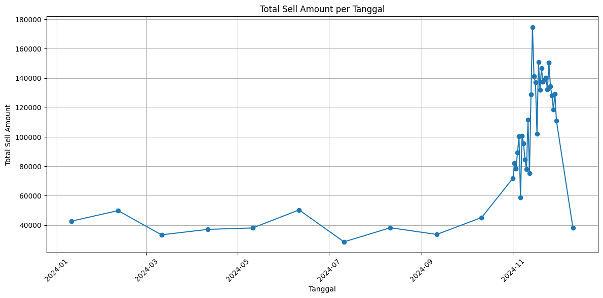

  <h1><strong>Data Science Project – Play Store Apps Analysis</strong></h1>

 

Project ini adalah bagian dari perjalanan belajar Data Science saya menggunakan dataset Google Ads. Fokus utama adalah memahami momen sale tertinggi berdasarkan tanggal, jumlah klik dan ikaln paling banyak diclick.

    <h2>DATASET<h2>

Sumber: Dataset Google Ads
Isi data: Campaign_Name, Clicks, Impressions, Cost, Leads, Conversions, dll.

    <h2>GOALS<h2>

Membersihkan dan memahami data (Data Cleaning)
Melakukan Exploratory Data Analysis (EDA)
Menemukan insight tentang iklan yang dipasang Google.

    <h2>DATA CLEANING<h2>

<ul>
    <li>-Menghapus missing value</li>
    <li>-Menangani data duplikat</li>
    <li>-Mengubah tipe data (contoh: Ad_Date)</li>
    <li>-Standarisasi format data</li>
</ul>

    <h2>Exploratory Data Analysis (EDA)<h2>

Beberapa analisis yang dilakukan:
<ul>
    <li>-Device Terbanyak Untuk Iklan</li>
    <li>-Device Apa Yang Memiliki Sale Terbanyak</li>
    <li>-Korelasi Antar Kolom</li>
    <li>-Kapan Waktu Dengan Sale Tertinggi</li>
</ul>

    <h2>TOOLS<h2>

<ul>
    <li>Python</li>
    <li>Pandas & NumPy</li>
    <li>Matplotlib & Seaborn</li>
    <li>Jupyter Notebook</li>
    <li>VScode</li>
</ul>

    <h2>INSIGHT<h2>

<ul>
    <li><h3>Sale Amount Terbanyak Berdasarkan Tanggal</h3></li>
    
    
Di Plot ini dapat dilihat jika pada 2024-12-11 Sale mengalami lonjakan drastis pada priode tersebut

     
    <li><h3>KATEGORI DENGAN INSTALL TERBANYAK</h3></li>
    
    
Dalam plot ini kita bisa melihat bahwa kategori dengan Installs terbanyak adalah GAME

     
     <li><h3>KATEGORI DENGAN RATA-RATA INSTALL TERBANYAK</h3></li>
    
    
Dalam plot ini bisa dilihat bahwa rata-rata Installs terbanyak adalah COMMUNICATION

    
Mengapa lebih banyak dari GAME padahal GAME memiliki jumlah total Installs terbanyak? Itu dikarnakan masing masing app dalam kategori COMMUNICATION memiliki Installs sangat banyak, contohnya WhatsApp yang sangat umum dan banyak digunakan oleh masyarakat. Sedangkan dalam kategori GAME Install masing masing aplikasi sangat sedikit walau jumlah app dalam kategori GAME sangat banyak

     
    <li><h3>TIPE APLIKASI YANG PALING BANYAK DIINSTALL (Free or Pay)</h3></li>
    
    
Dalam data dari plot ini dapat dilihat bahwa app free jauh lebih banyak diinstall daripada pay to use app, selain karna free app jauh lebih ramah dompet jumlah app free juga jauh lebih banyak daripada app pay to use

     
</ul>

    <h2>NOTE<h2>

Project ini dibuat untuk belajar, jadi masih terus berkembang dan akan di-update seiring progres belajar Data Science saya.
